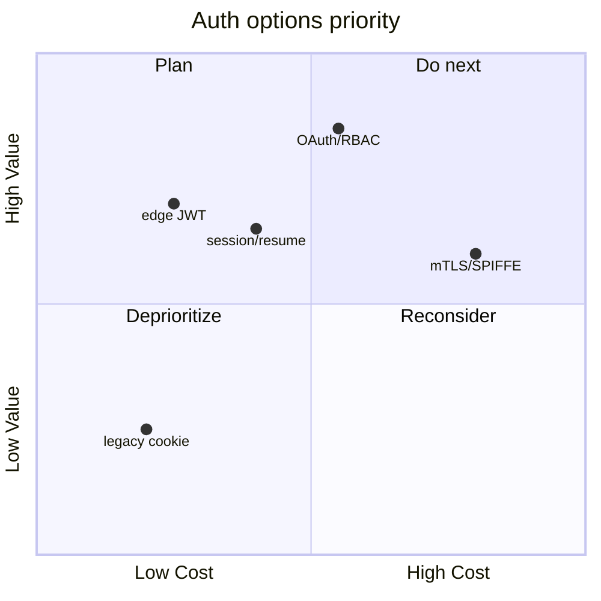
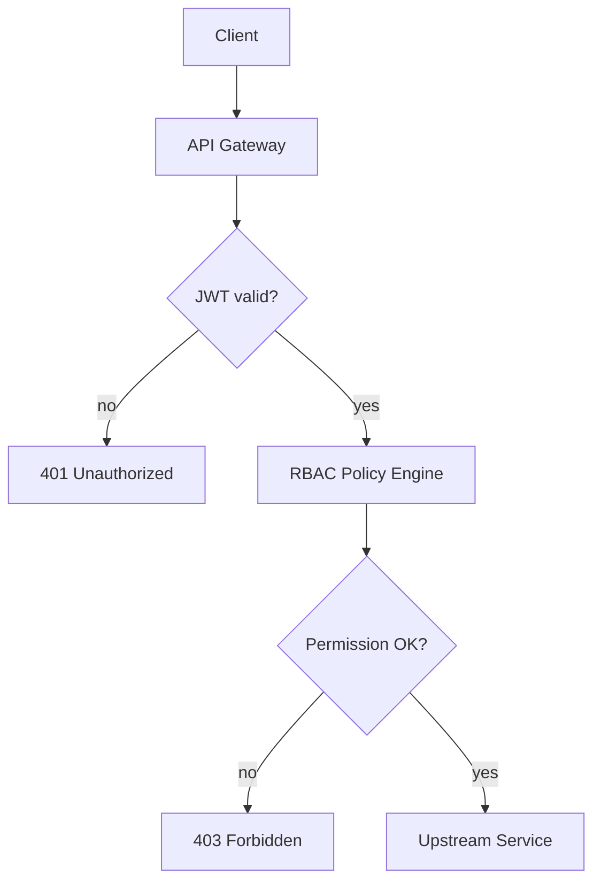

# 架构评审：统一鉴权方案对比与落地建议

> **评审结论**：短期保留 *网关 JWT 校验*，中期收敛 **OAuth 2.1 + RBAC**；~~自研 Token~~ 不再作为主路径。

> [!NOTE]
> 本文档是 `md_to_pic` 渲染压测夹具：覆盖标题、表格、代码、列表、公式与 Mermaid 等 GFM 元素，**不代表**线上最终决策。

## 背景与目标

多服务各自签发 Token，配置散落在 `/etc/auth/keys` 与 `C:\\Users\\svc\\config\\auth.yaml`，*运维成本* 与 **安全面** 同步扩大。目标统一 **认证**、**授权** 与 `session/resume`。

### 范围与非目标

- **范围内**：BFF、内部 API、Worker 鉴权
  - 同步 HTTP / gRPC 入口
  - 跨集群 `service-to-service` 调用
- **非目标**：硬件 TEE、离线 DRM
  - 不评估 ~~浏览器插件注入~~ 方案

### 关键约束

1. 兼容现有 `JWT` 字段 `sub` / `scope`
2. 密钥轮换窗口 ≤ *24h*，且 **零停机**
   1. 双钥并存期可配置
   2. 旧钥吊销后必须开启回放检测

## 方案对比

按 **复杂度 / 可观测性 / 迁移成本** 三维度打分，见下表。

| 方案 | 复杂度 | 迁移成本 |
| --- | --- | --- |
| 边缘 JWT 校验 | 低 | 低 |
| OAuth 2.1 + PKCE | 中 | 中 |
| mTLS + SPIFFE | 高 | 高 |

| 能力 | JWT 边缘 | OAuth/RBAC |
| --- | --- | --- |
| 细粒度授权 | 弱 | **强** |
| 会话吊销 | *难* | 易 |
| 运维配置 | `/etc/jwt/public.pem` | `C:\\Users\\ops\\rbac\\policy.json` |

> 「先收敛身份，再收紧授权」—— 与 [OAuth 2.1 草案](https://datatracker.ietf.org/doc/html/draft-ietf-oauth-v2-1) 及 [RFC 8725](https://www.rfc-editor.org/rfc/rfc8725) 的建议一致。

裸参考：https://oauth.net/2/

### 推荐路径

短期 **保留** 网关 `JWT` 验签；并行引入 *RBAC 策略中心*，用 `OAuth` 客户端凭证覆盖机器流量。长期评估 ~~纯 Cookie Session~~ 仅作为浏览器兜底。

## 实现要点

签发与校验应可在 CI 中用 `pytest` 与 `tsc --noEmit` 双侧回归；密钥材料禁止写入业务仓库。

```python
from jose import jwt

def issue_access_token(sub: str, scopes: list[str]) -> str:
    return jwt.encode(
        {"sub": sub, "scope": " ".join(scopes)},
        key=load_private_key("/etc/auth/private.pem"),
        algorithm="RS256",
    )
```

```typescript
import { createRemoteJWKSet, jwtVerify } from "jose";

const jwks = createRemoteJWKSet(
  new URL("https://idp.example.com/.well-known/jwks.json"),
);

export async function assertBearer(token: string) {
  const { payload } = await jwtVerify(token, jwks, { audience: "api" });
  return payload.sub as string;
}
```

```bash
# 轮换公钥到共享配置目录（Unix / Windows 双路径）
install -m 644 ./jwks.json /etc/auth/jwks.json
cp ./jwks.json "C:\\Users\\svc\\shared\\jwks.json"
curl -sf https://idp.example.com/healthz
```

现网校验逻辑（节选，行号引用便于评审对照）：

```296:301:src/auth.py
def verify_token(raw: str) -> Claims:
    header = peek_header(raw)
    key = keyring.get(header["kid"])
    return jwt.decode(raw, key=key, algorithms=["RS256"])
```

### 运维检查清单

- 确认 `C:\\Users\\bar\\baz.py` 部署脚本与 `/etc/foo` 挂载一致
- 核对 `IDP_URL`、`AUDIENCE`、`CLOCK_SKEW` 三处环境变量
- 灰度时观察 *p99 延迟* 与 **401/403 比例**
- 回滚开关：`AUTH_MODE=legacy_jwt`（~~永久默认~~ 仅应急）

有序 rollout：

1. 影子模式：只记日志不拦截
2. 金丝雀 5% → 25% → 100%
   1. 每阶段观察 `auth_deny_total`
   2. 异常则回退到 *legacy* 路径
3. 关闭旧入口并归档文档

无序补充：

- 审计日志写入 `/var/log/auth/audit.jsonl`
- 值班手册更新 **on-call runbook**
  - 包含 `session/resume` 失败排查
  - 包含 Windows 侧 `C:\\Users\\ops\\runbooks\\auth.md`

## 决策矩阵与数据流

优先级矩阵（右上为高价值低成本；含特殊字符的点 label 用引号）：



请求主路径（5–8 个节点）：



## 风险、公式化权衡与行动项

认证失败率与资源消耗可用简化模型描述：令边际成本近似满足 $E = mc^2$ 的「质量—能量」直觉（*玩笑式* 类比：错误配置的 **质量** 会以故障能量释放）。更严谨的连续权衡用高斯型积分刻画平滑衰减：

$$
\int_0^\infty e^{-x^2} dx
$$

- **风险 1**：密钥泄露 → 立即吊销 `kid` 并轮换 `/etc/auth/private.pem`
- **风险 2**：时钟漂移 → 统一 NTP，`CLOCK_SKEW` 默认 *60s*
- **风险 3**：策略漂移 → RBAC 变更走 PR + 双人审批，~~口头放行~~ 禁止

行动项（负责人 / 截止）：

1. 落地 JWKS 拉取与缓存（`ttl=300s`）
2. 补齐 `C:\\Users\\ci\\scripts\\auth_smoke.py` 与 `/etc/ci/auth_smoke.sh`
   1. 覆盖 **OAuth** 客户端凭证
   2. 覆盖 *RBAC* 拒绝路径
3. 评审会后冻结 ADR，链接回本仓库 README

---

*文档版本*：v0.4 · **状态**：草案 · 路径：`/etc/foo` · `C:\\Users\\bar\\baz.py` · 关键词：`JWT` `OAuth` `RBAC` `mTLS` `PKCE` `JWKS` `SPIFFE` `session/resume`
